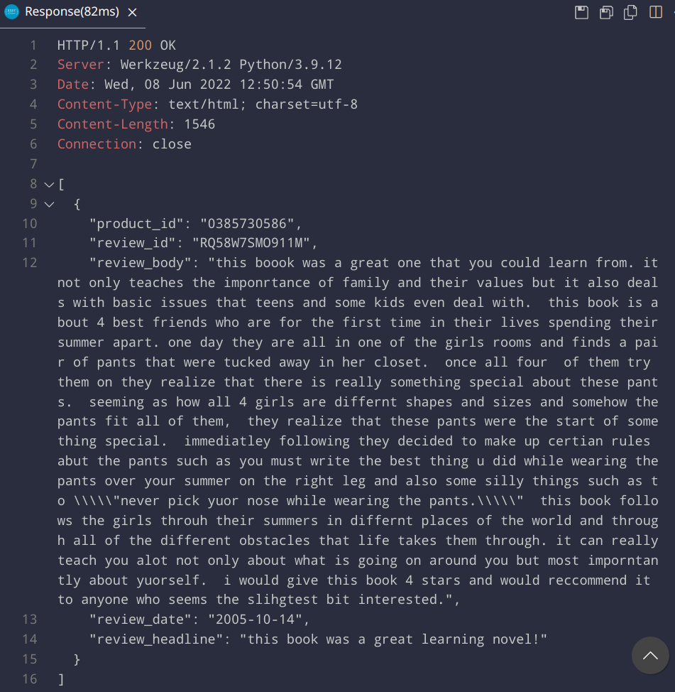
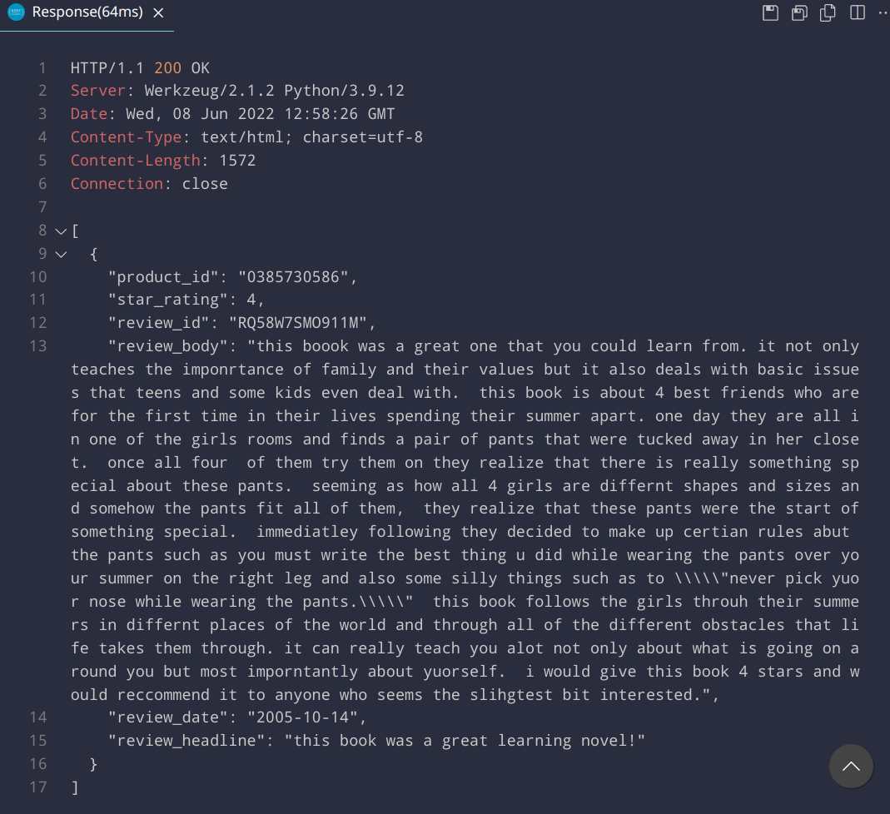
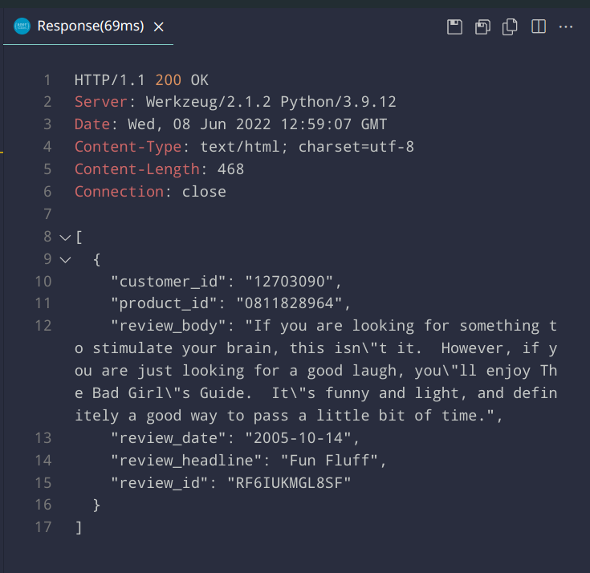
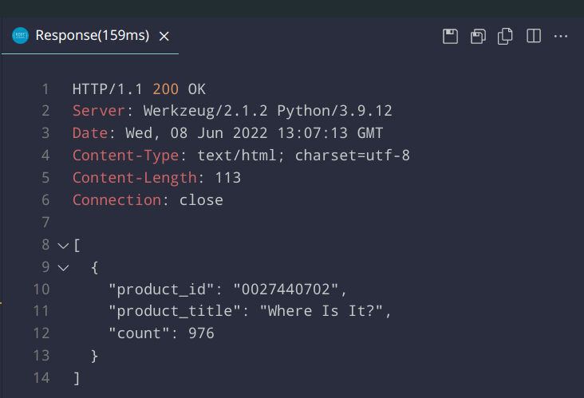
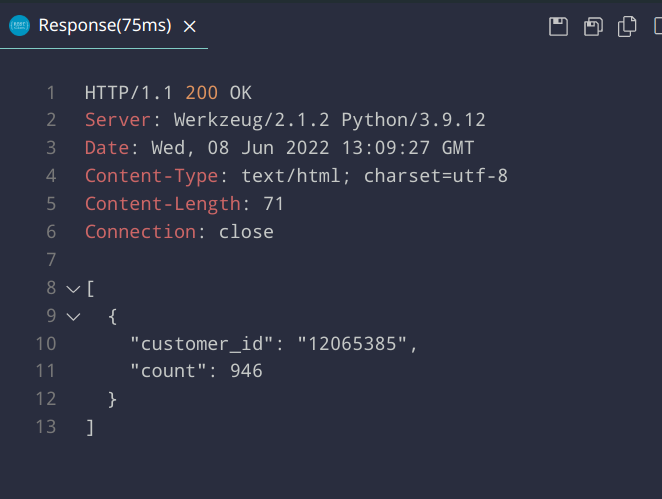
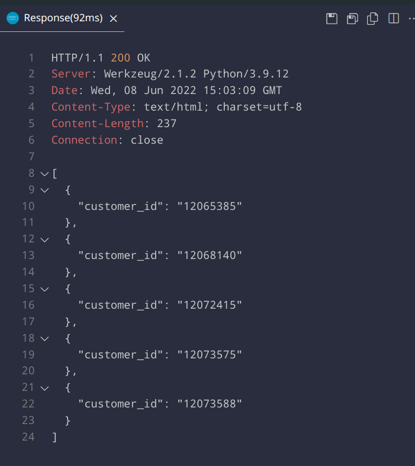
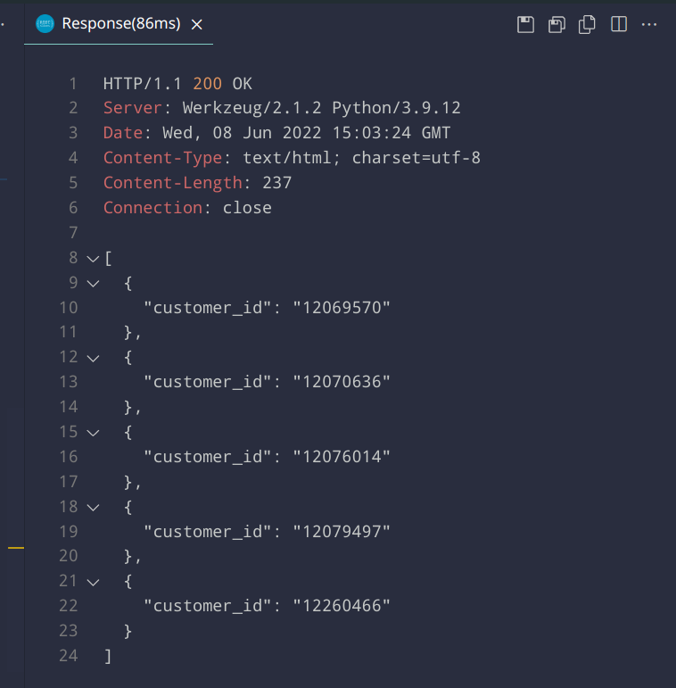

Start the Cassandra instance and the app, fill up the tables:

```
./run-cluster.sh
./fill-tables.sh
./run-server.sh
```

queries, which are found in requests.http

Task 1:



Task 2:



Task 3:



Task 4:



Task 5:



Task 6:



Task 7:


