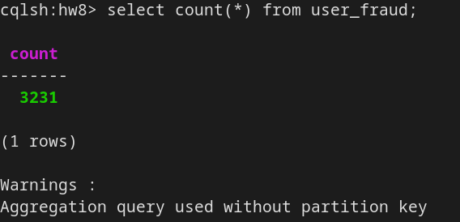

Launching the kafka instance, cassandra instance:

```
./run-kafka-cluster.sh
./run-cassandra-cluster.sh
```

Writing into kafka and from kafka into cassandra:

```
./kafka/run.sh
./kafka-cassandra/run.sh
```

And launching the REST server:
```
./rest/run.sh
```

The working kafka-cassandra pipeline:




Request 1


Request 2


Request 3


