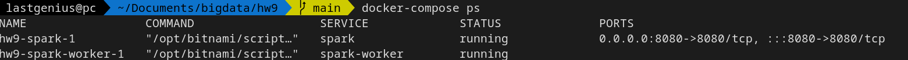
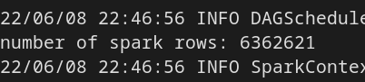

Installing and launching Spark

```
docker-compose up -d
docker run --rm -it --network spark-network --name spark-submit -v /home/lastgenius/Documents/bigdata/hw9:/opt/app bitnami/spark:3 /bin/bash 
```

Working setup:



Inside the interactive session:

```
cd /opt/app
spark-submit --master local[*] --deploy-mode client spark_read.py
```

After the script:



Shutting down the setup:

```
docker-compose down
```
